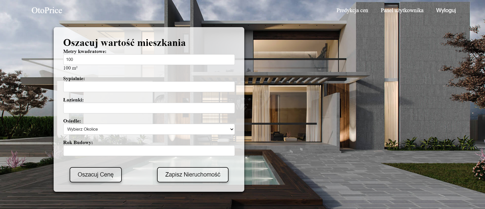
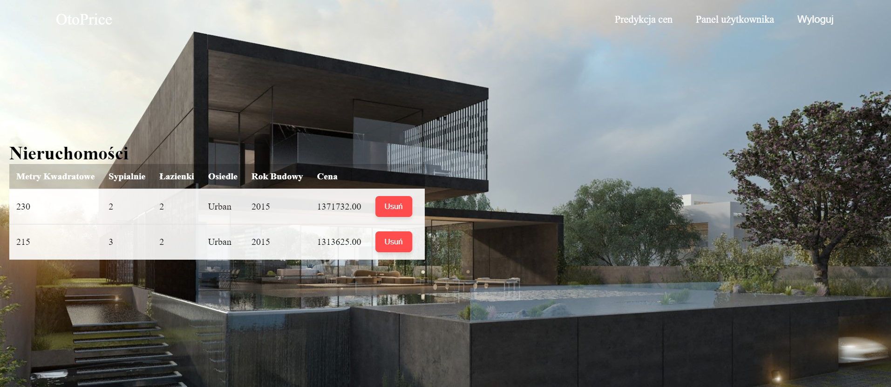

# House Price Prediction Application

This is my engineering project on house price prediction using a dataset from Kaggle. The application is a web application built with Django for the backend and Vue.js for the frontend. App is contenerized via Docker.

## Features
- Predict house prices based on various features
- User-friendly interface
- Data visualization

## Installation

### Prerequisites
Make sure you have Docker installed on your machine.

### Setting Up the Backend

1. **Clone the repository:**
   ```bash
   git clone <repository-url>
   cd <repository-directory>
2. **Build and run the Docker containers:**
   ```bash
   docker-compose up --build

### Ensuring Database Connectivity
To make sure the Django backend connects to the PostgreSQL database, ensure you have the right password for your pgAdmin app in env in your Django
## Demo



